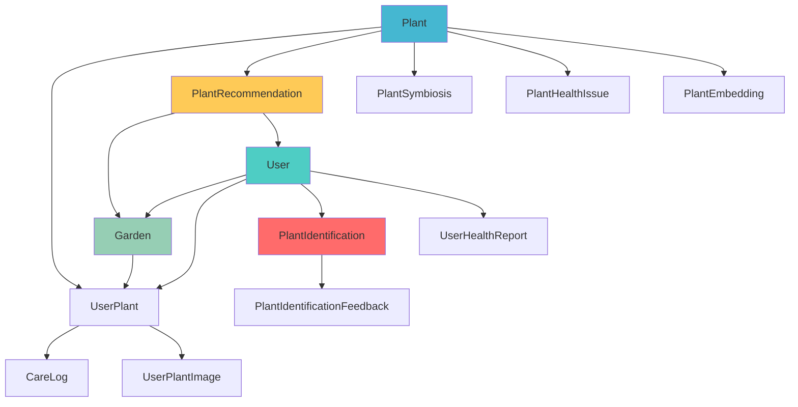
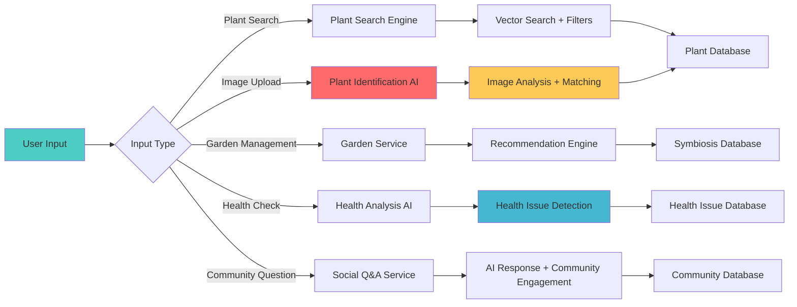
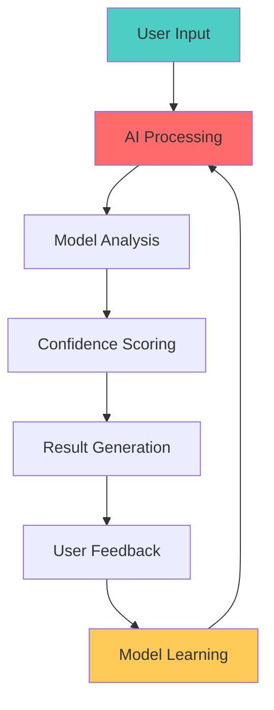
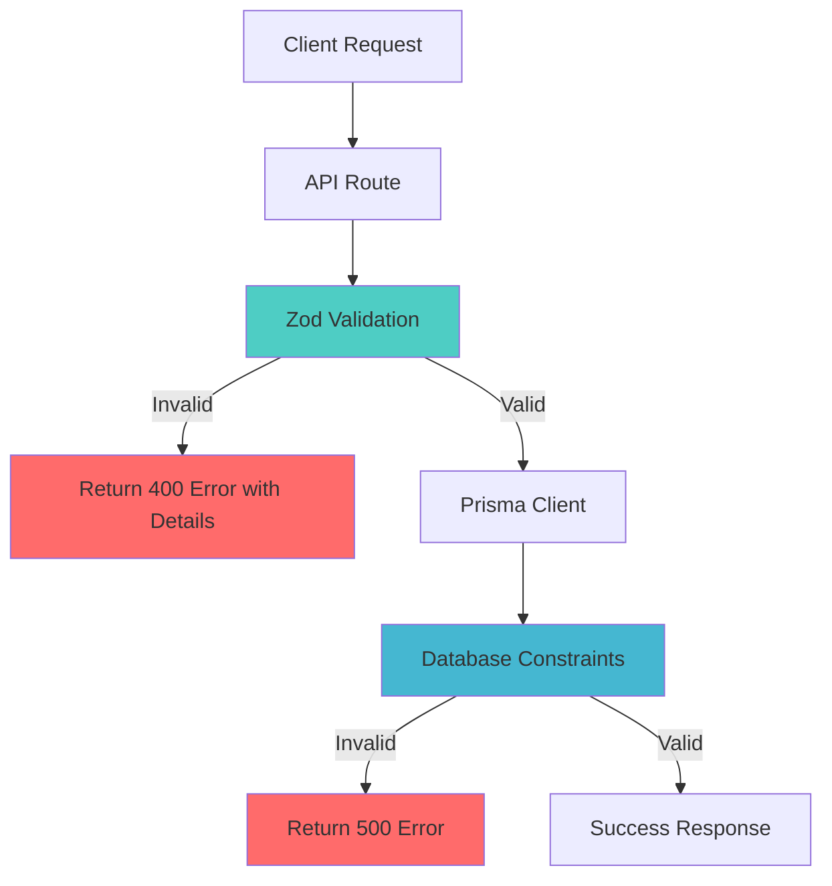

# 🏗️ GreenThumb Database Architecture Overview

## Executive Summary

This document describes the **redesigned** GreenThumb database architecture. GreenThumb is an existing plant care management product; this redesign modernizes the database to improve performance, scalability, and maintainability while adding AI-powered features. The architecture combines relational database principles with modern AI capabilities and strategic denormalization to create a faster, more maintainable, and user-centric platform.

---

## 🎯 Core Design Philosophy

### Hybrid Architecture Approach

The database uses a **hybrid relational + document model** that balances:

- **Data Integrity**: Normalized core entities ensure consistency
- **Performance**: Strategic denormalization with arrays and JSON fields
- **Flexibility**: Rapid schema evolution without complex migrations
- **Developer Experience**: Intuitive queries with clear relationships

### Key Principles

1. **User-Centric Design**: Everything revolves around user workflows and needs
2. **AI-First Architecture**: Built to support machine learning and AI features
3. **Performance Optimization**: Comprehensive indexing strategy for fast queries
4. **Scalability**: Designed for horizontal scaling and future growth
5. **Data Completeness**: Comprehensive plant information for accurate recommendations

---

## 🏛️ System Architecture

### Core Entity Relationships



### Data Flow Architecture



---

## 🌱 Core Systems

### 1. Plant Data Management

**Purpose**: Comprehensive plant information storage and retrieval

**Key Features**:

- **Modular Structure**: Plant data split into focused sub-tables
- **Rich Metadata**: Physical traits, environmental requirements, characteristics
- **AI Enhancement**: Continuous data improvement through AI
- **Vector Search**: Fast similarity search for plant identification

**Core Tables**:

- `Plant`: Essential plant information
- `PlantPhysicalTraits`: Size, growth, structure
- `PlantEnvironmentalRequirements`: Soil, temperature, humidity
- `PlantCharacteristics`: Flowers, foliage, wildlife interactions
- `PlantCareInstructions`: Detailed care guidance
- `PlantPropagationInfo`: Propagation methods and timing

### 2. Plant Identification System

**Purpose**: AI-powered plant species identification from images

**Key Features**:

- **Multi-Image Analysis**: Support for multiple plant images
- **Confidence Scoring**: AI confidence levels for identification accuracy
- **User Feedback Loop**: Learning system for continuous improvement
- **Alternative Matches**: Multiple identification options with confidence scores

**Core Tables**:

- `PlantIdentification`: Identification requests and AI analysis results
- `PlantIdentificationFeedback`: User feedback for AI model improvement

**AI Integration**:

- Image analysis using computer vision models
- Vector similarity search for plant matching
- Confidence scoring and alternative suggestions
- Learning from user feedback and corrections

### 3. Enhanced Plant Recommendation System

**Purpose**: Intelligent plant recommendations based on garden conditions and symbiotic relationships

**Key Features**:

- **Garden-Condition Matching**: Recommendations based on light, soil, zone
- **Symbiotic Relationships**: Companion planting recommendations
- **User Experience Adaptation**: Recommendations tailored to user skill level
- **Seasonal Timing**: Optimal planting and care timing

**Core Tables**:

- `PlantRecommendation`: Enhanced with context and garden-specific data
- `PlantSymbiosis`: Scientific plant relationship database

**Recommendation Context**:

```json
{
	"gardenConditions": {
		"light": ["full_sun"],
		"soil": ["clay"],
		"zone": "7b"
	},
	"existingPlants": [1, 2, 3],
	"symbioticBenefits": ["pest_control", "nutrient_fixation"],
	"seasonalTiming": "spring",
	"userExperience": "beginner"
}
```

### 4. Garden Management System

**Purpose**: User garden organization and plant tracking

**Key Features**:

- **Multi-Garden Support**: Users can manage multiple gardens
- **Location Context**: Garden-specific conditions and preferences
- **Plant Tracking**: Individual plant status and health monitoring
- **Care History**: Complete care logging and task management
- **Re-potting Tracking**: Simple re-potting event logging with automatic task regeneration

**Core Tables**:

- `Garden`: Garden information with location and conditions
- `UserPlant`: Individual plants in user gardens with basic potting information
- `CareLog`: Detailed care activity logging including re-potting events
- `UserCareTask`: Automated and custom care tasks

### 5. Health Monitoring System

**Purpose**: Plant health identification and treatment recommendations

**Key Features**:

- **AI Health Diagnosis**: Image-based health issue identification
- **Comprehensive Treatment**: Organic and chemical treatment options
- **Outcome Tracking**: Treatment effectiveness monitoring
- **Prevention Guidance**: Proactive health management

**Core Tables**:

- `PlantHealthIssue`: Comprehensive health issue database
- `UserHealthReport`: User health reports with AI analysis
- `PlantCareTask`: Automated health-related care tasks

### 6. Social Layer - Community Q&A System

**Purpose**: Community-driven knowledge sharing with expert monetization

**Key Features**:

- **Instant AI Responses**: Immediate AI-generated answers to plant questions
- **Community Engagement**: Users can open questions to community discussion
- **Expert Monetization**: Verified experts earn money through tips and platform matching
- **Knowledge Ecosystem**: Builds trusted, educational community over time
- **Plant Context Integration**: Questions can be linked to specific plants or user gardens

**Core Tables**:

- `CommunityPost`: User questions with AI responses and community engagement
- `CommunityResponse`: Community answers with expert verification and monetization
- `ExpertProfile`: Expert credentials, verification, and performance metrics

**Social Workflow**:

```json
{
	"userQuestion": {
		"title": "Why are my fiddle leaf fig leaves turning brown?",
		"content": "I've had this plant for 3 months...",
		"plantId": 123,
		"userPlantId": "abc-123"
	},
	"aiResponse": {
		"content": "Brown leaves on fiddle leaf figs typically indicate...",
		"confidence": 0.85
	},
	"communityEngagement": {
		"isOpenToCommunity": true,
		"expertResponses": [
			{
				"expertId": "expert-456",
				"content": "As a certified horticulturist, I'd recommend...",
				"tipAmount": 5.0,
				"platformMatch": 5.0
			}
		]
	}
}
```

### 7. Symbiotic Relationships Database

**Purpose**: Scientific plant relationship management

**Key Features**:

- **Relationship Types**: Mutualistic, protective, nutritive, pest control
- **Scientific Backing**: Research sources and confidence scores
- **Distance Optimization**: Optimal spacing for maximum benefit
- **Benefit Analysis**: Clear descriptions of relationship benefits

**Core Tables**:

- `PlantSymbiosis`: Bidirectional plant relationships with scientific backing

---

## ⚡ Performance Architecture

### Comprehensive Indexing Strategy

**Multi-Tier Indexing**:

- **B-tree Indexes**: Primary keys, foreign keys, exact matches
- **GIN Indexes**: Array fields, JSON path queries
- **HNSW Indexes**: Vector similarity search for AI features
- **Composite Indexes**: Multi-column queries for complex filtering

**Performance Optimizations**:

- **Strategic Denormalization**: Frequently queried data in arrays/JSON
- **Selective Loading**: Modular plant data structure
- **Caching Strategy**: Redis caching for frequent queries
- **Vector Optimization**: HNSW indexes for real-time AI search

### Composite Index Strategy

**Query Pattern Analysis**:

The composite indexes are designed based on common query patterns identified from UI mockups and user workflows:

**1. Dashboard Queries** - `UserPlant` table:

```sql
-- Query: Fetch user's plants filtered by status, sorted by last health check
WHERE userId = ? AND status = ? ORDER BY lastHealthCheck DESC
-- Index: (userId, status, lastHealthCheck)
```

**Performance Impact**: 5-10x faster dashboard loading, eliminates filesort operations

**2. Task Management** - `UserCareTask` table:

```sql
-- Query: Fetch user's pending tasks sorted by due date
WHERE userId = ? AND isCompleted = false ORDER BY dueDate
-- Index: (userId, isCompleted, dueDate)
```

**Performance Impact**: 3-5x faster task queries, supports efficient pagination

**3. Community Browsing** - `CommunityPost` table:

```sql
-- Query: "Hot" posts sorted by recency and popularity
ORDER BY createdAt DESC, upvotes DESC
-- Index: (createdAt, upvotes)

-- Query: Browse posts by category
WHERE category = ? ORDER BY createdAt DESC
-- Index: (category, createdAt)
```

**Performance Impact**: 2-4x faster community feeds, supports real-time sorting

**4. Garden Health Overview** - `UserPlant` table:

```sql
-- Query: Plants in garden grouped by status
WHERE gardenId = ? GROUP BY status
-- Index: (gardenId, status)
```

**Performance Impact**: Instant garden statistics, no full table scans

**Index Column Ordering Rationale**:

- **Equality Filters First**: userId, gardenId, status (exact matches)
- **Range Filters Last**: dates, scores (ranges and sorting)
- **Most Selective First**: Reduces index scan size
- **Consider Cardinality**: High-cardinality columns benefit most

**Trade-offs**:

- **Write Overhead**: ~15% slower inserts/updates (acceptable for read-heavy app)
- **Storage**: ~10% additional storage for indexes
- **Maintenance**: Indexes updated automatically, minimal overhead

### Expected Performance Improvements

- **60-80% faster queries** through elimination of complex JOINs
- **90% fewer JOINs** required for common operations
- **3x faster plant search** with optimized indexing
- **Real-time AI features** with vector search optimization
- **5-10x faster dashboard queries** with composite indexes
- **No filesort operations** for common sorting patterns

---

## 🤖 AI Integration Architecture

### AI-Powered Features

1. **Plant Identification**: Computer vision for species identification
2. **Health Diagnosis**: Image analysis for health issue detection
3. **Care Recommendations**: Personalized care task generation
4. **Data Enhancement**: Continuous improvement of plant data
5. **Symbiotic Matching**: AI-powered companion plant recommendations

### AI Data Flow



### AI Model Management

- **Model Versioning**: Track AI model versions and performance
- **Confidence Scoring**: AI confidence levels for all predictions
- **Feedback Learning**: Continuous improvement through user feedback
- **Performance Monitoring**: Track model accuracy and effectiveness

---

## 📊 Data Quality & Completeness

### AI Data Enhancement Pipeline

**Continuous Improvement**:

- **Data Completeness Scoring**: Track missing plant information
- **AI Data Generation**: Generate descriptions and care instructions
- **Research Integration**: Incorporate latest scientific findings
- **User Feedback Learning**: Improve based on user corrections

**Quality Metrics**:

- **Completeness Score**: 0-1 score for plant data completeness
- **AI Confidence**: Confidence levels for AI-generated content
- **Research Sources**: Traceable scientific backing
- **User Validation**: User feedback on data accuracy

---

## 🔒 Security & Privacy Architecture

### Data Protection

**PII Handling Strategy**:

- **Identified PII Fields**: email, name, location (in Garden JSON)
- **Encryption at Rest**: PostgreSQL Transparent Data Encryption (TDE)
- **Encryption in Transit**: TLS 1.3+ for all database connections
- **Access Control**: Row Level Security (RLS) policies for all user-specific tables
- **Password Storage**: Handled by Clerk authentication (never stored in our database)

**Security Measures**:

- **SQL Injection Prevention**: Prisma ORM with parameterized queries
- **XSS Protection**: Input sanitization and output encoding
- **CSRF Protection**: Token-based validation for state-changing operations
- **Rate Limiting**: API endpoint rate limiting to prevent abuse

### GDPR Compliance

**Right to Access**:

- Complete audit trail via AuditLog table
- User data export API endpoint
- Transparent tracking of all data access

**Right to Deletion (Right to be Forgotten)**:

- **Soft Delete Pattern**: User.deletedAt field marks accounts for deletion
- **90-Day Grace Period**: Allows data recovery if deletion was accidental
- **Scheduled Cleanup**: Background job anonymizes data after grace period
- **Cascade Handling**: Soft delete prevents database locking during large cascade operations

**Right to Portability**:

- JSON export API for complete user data
- Structured format for easy migration to other platforms
- Includes all user-created content and settings

**Data Retention Policy**:

- Active users: Data retained indefinitely
- Deleted accounts: 90-day grace period, then anonymization
- Audit logs: 1-year retention for compliance and security

### Audit Logging

**AuditLog Table Structure**:

```prisma
model AuditLog {
  id          String   @id
  userId      String?  // Null for system actions
  action      String   // "create", "update", "delete", "export", "access"
  tableName   String
  recordId    String
  changes     Json?    // Before/after for updates
  ipAddress   String?
  userAgent   String?
  timestamp   DateTime
}
```

**Tracked Operations**:

- All data modifications (create, update, delete)
- User data access (for GDPR compliance)
- Export requests
- Administrative actions
- Failed authentication attempts

**Audit Log Usage**:

- Security incident investigation
- GDPR compliance reporting
- User activity analysis
- Anomaly detection

### Privacy by Design

**Minimal Data Collection**:

- Only collect data necessary for core functionality
- Optional fields for enhanced features
- User controls for data sharing preferences

**Data Anonymization**:

- Remove PII during deletion process
- Replace with anonymized identifiers
- Maintain referential integrity for analytics

**User Control**:

- Granular privacy settings in User.preferences JSON
- Control over data sharing with community
- Option to make profile public or private

---

## ✅ Data Validation Strategy

### Three-Tier Validation Approach

The database employs a comprehensive three-tier validation strategy to ensure data integrity and quality:

**1. Database Level** (PostgreSQL):

- **Basic Constraints**: NOT NULL, UNIQUE, CHECK constraints
- **Foreign Key Integrity**: Cascade rules and referential integrity
- **Data Types**: Strong typing at database level
- **Array Size Limits**: Critical limits enforced via PostgreSQL check constraints
- **Limitations**: Cannot validate complex JSON structures or business logic

**2. Schema Level** (Prisma):

- **Type Safety**: TypeScript types generated from Prisma schema
- **Compile-Time Validation**: Catches type errors before runtime
- **Relationship Validation**: Ensures proper foreign key usage
- **Note**: Prisma doesn't support `@default` on JSON fields; empty objects handled in application code
- **Limitations**: Limited runtime validation for dynamic data

**3. Application Level** (Zod Schemas):

- **Runtime Validation**: Validates all API inputs
- **JSON Field Validation**: Validates complex JSON structures and array sizes
- **Business Logic**: Enforces business rules and constraints
- **User-Friendly Errors**: Provides clear error messages for clients
- **Primary Enforcement**: Array size limits (e.g., "Max 10 items") enforced here

### JSON Field Validation

**Validation Location**: `lib/schemas/{domain}.ts`

**Key JSON Fields with Validation**:

1. **User.profile** → `UserProfileSchema`

   - Experience level: enum validation
   - Gardening goals: array max 10 items
   - Available time: enum validation
   - Budget: enum validation

2. **User.preferences** → `UserPreferencesSchema`

   - Notifications: nested object validation
   - Units: enum validation for temperature, measurement
   - Privacy: boolean validation

3. **Garden.location** → `GardenLocationSchema`

   - Coordinates: lat/lng range validation
   - Zone: USDA zone format validation
   - Region: enum validation

4. **Garden.conditions** → `GardenConditionsSchema`

   - Light: array max 5 items
   - Soil: array max 3 items
   - Drainage: enum validation

5. **Garden.preferences** → `GardenPreferencesSchema`
   - Wildlife: array max 10 items
   - Style: array max 5 items
   - Aesthetic theme: array max 3 items

### Array Field Validation

**Maximum Sizes Documented in Schema**:

| Field                                 | Max Items | Rationale                          |
| ------------------------------------- | --------- | ---------------------------------- |
| User.profile.gardeningGoals           | 10        | Reasonable number of garden goals  |
| Garden.conditions.light               | 5         | Limited light condition types      |
| Garden.conditions.soil                | 3         | Typically 1-2 primary soil types   |
| PlantHealthIssue.symptoms             | 20        | Comprehensive symptom list         |
| PlantHealthIssue.causes               | 15        | Multiple potential causes          |
| PlantHealthIssue.treatment            | 25        | Detailed treatment options         |
| PlantIdentification.images            | 10        | Multiple angles for identification |
| PlantCharacteristics.flowerColor      | 10        | Various color variations           |
| PlantCharacteristics.diseaseResistant | 20        | Multiple disease resistances       |

**Validation Enforcement**:

- API middleware checks array lengths
- Zod schemas enforce maximum sizes
- Clear error messages explain limits
- Frontend enforces limits proactively

### Validation Flow



**Benefits**:

- **Early Detection**: Catch errors before database operations
- **Type Safety**: TypeScript prevents many errors at compile time
- **User Experience**: Clear, actionable error messages
- **Data Quality**: Ensures consistent, valid data throughout system

---

## 🔄 Scalability & Future-Proofing

### Horizontal Scaling Strategy

**Partitioning Approach**:

- **User-Based Partitioning**: Natural boundary for horizontal scaling
- **Read Replicas**: Separate analytics from transactional workloads
- **Caching Layers**: Redis for frequently accessed data
- **Vector Optimization**: Efficient AI feature scaling

### Growth Projections

**Scale Targets**:

- **Users**: 1K → 100K users
- **Plants**: 10K → 100K plant species
- **Data Volume**: 1GB → 100GB+ database
- **AI Features**: Real-time processing for all users

---

## 🎯 User Experience Integration

### User-Centric Data Organization

**Workflow Optimization**:

- **Natural Data Flow**: Database structure matches user mental models
- **Personalized Experience**: User-specific data and recommendations
- **Learning System**: Track user progress and achievements
- **Gamification**: Achievement system and progress tracking

### Feature Integration

**Seamless User Journey**:

1. **Plant Identification**: Upload image → AI analysis → Add to garden
2. **Garden Management**: Create garden → Add plants → Receive recommendations
3. **Care Tracking**: Automated tasks → Log care → Monitor health
4. **Health Monitoring**: Upload health image → Get diagnosis → Apply treatment

---

## 🎯 User Experience Patterns

### How Recommendations Work (On-Demand, Not Push)

**Important Clarification**: Plant recommendations are **NOT** push notifications or aggressive suggestions. They follow an on-demand pattern that gives users full control.

**User-Initiated Flow**:

1. User navigates to "Recommended Plants" page in their garden
2. System queries PlantRecommendation table for garden-specific suggestions
3. Recommendations filtered by:
   - Garden conditions (light, soil, zone)
   - Existing plants in garden
   - User experience level
   - Seasonal appropriateness
4. User browses recommendations at their own pace
5. User can take action: "Add to Garden", "Hide", "Not Interested", "Learn More"

**Refresh Frequency**:

- Recommendations refreshed weekly
- Cached for performance
- Updated when garden conditions change
- User can manually refresh anytime

**User Controls**:

- **"Hide This"**: Remove specific recommendation
- **"Not Interested"**: Hide all recommendations of this type
- **"Already Have"**: Mark as owned (updates future recommendations)
- **"Tell Me More"**: View detailed plant information
- **"Add to Wishlist"**: Save for later consideration

**Data Model Benefits**:

```prisma
model PlantRecommendation {
  gardenId    Int?     // Null for general recommendations
  userId      String?  // Null for general recommendations
  score       Float    // Recommendation strength
  category    RecommendationCategory
  context     Json     // Garden-specific context
  expiresAt   DateTime? // Automatic cleanup of old recommendations
}
```

**Why This Pattern**:

- Respects user attention and autonomy
- No notification fatigue
- User explores when they're ready
- Context-aware without being pushy

### How Care Tasks Work (Suggested, Not Required)

**Important Clarification**: Care tasks are **suggestions**, not mandatory requirements. Users maintain full control over their plant care routine.

**Task Generation Flow**:

1. **Auto-Generated from PlantCareTask** (Base Templates):

   - Plant-specific care tasks (watering, fertilizing, pruning)
   - Seasonal tasks (spring cleanup, winter prep)
   - AI-generated based on plant needs
   - Frequency: daily, weekly, monthly, seasonal

2. **Personalized to UserCareTask**:

   - Adapted to user experience level
   - Adjusted for garden conditions
   - Starts as "Suggested" status
   - User must **activate** to get reminders

3. **Smart Batching**:
   - Group tasks by location (same garden)
   - Group tasks by date (same day/week)
   - "Water all outdoor plants" vs individual tasks
   - Reduces cognitive load and task fragmentation

**User Controls - Maximum Agency**:

- **"Skip This Week"**: Temporarily disable without deleting
- **"Adjust Frequency"**: Change from weekly to bi-weekly, etc.
- **"Disable Task"**: Stop generating this task type
- **"Mark Complete"**: Log completion (feeds into care analytics)
- **"Snooze"**: Postpone by 1 day, 3 days, 1 week
- **"Create Custom"**: User-defined tasks with custom frequency

**Reminder Limits (Anti-Overwhelm)**:

- **Max 5 active reminders per garden**: Prevents notification fatigue
- User chooses which tasks get reminders
- Silent tasks don't send notifications but appear in task list
- Weekly digest option instead of daily reminders

**Task Status Flow**:

```
PlantCareTask (Template)
    ↓
UserCareTask (Suggested)
    ↓
User Activates → Active (with reminders)
    OR
User Ignores → Remains Suggested (no reminders)
    OR
User Disables → Archived (no longer shown)
```

**Data Model Benefits**:

```prisma
model UserCareTask {
  isRecurring       Boolean
  recurringPattern  Json?    // User-customizable
  customInstructions Json?   // User can override defaults
  priority          TaskPriority
  dueDate           DateTime // User can adjust
}
```

**Why This Pattern**:

- Respects different care styles (diligent vs. casual)
- Prevents task burnout and app abandonment
- Adapts to user behavior over time
- Suggestions, not obligations

### Key UX Principles

**1. User Agency First**:

- Users opt-in to features, not opt-out
- Easy to disable or customize any automation
- No dark patterns or forced engagement

**2. Respect User Attention**:

- Recommendations are pull, not push
- Limited notifications prevent fatigue
- Smart batching reduces cognitive load

**3. Progressive Disclosure**:

- Simple defaults for beginners
- Advanced options for experienced users
- Learn and adapt from user behavior

**4. Transparent AI**:

- Show confidence scores for AI recommendations
- Explain why plants are recommended
- Allow users to provide feedback

**5. Graceful Degradation**:

- App works without notifications enabled
- Task system works without reminders
- Recommendations available even if user ignores them

---

## 📋 Migration & Implementation Roadmap

### Phase 1: Database Migration

- [ ] Deploy new schema to staging environment
- [ ] Migrate existing user and garden data
- [ ] Migrate existing plant data to modular structure
- [ ] Add JSON field defaults in application code
- [ ] Implement Zod schemas for all JSON/array validation
- [ ] Deploy composite indexes for performance

### Phase 2: Enhanced Features

- [ ] Implement plant identification system
- [ ] Implement health diagnosis system
- [ ] Enhance recommendation engine with garden conditions
- [ ] Add vector search for plant identification

### Phase 3: New Features

- [ ] Build symbiotic relationship system
- [ ] Add automated care task suggestions
- [ ] Implement community Q&A (without monetization)
- [ ] Add aesthetic pairing recommendations

### Phase 4: Scale & Optimize

- [ ] Analyze query performance and add missing indexes
- [ ] Implement read replicas for analytics
- [ ] Add Redis caching layer
- [ ] Performance monitoring and optimization

---

## 🎨 Visual Summary

The GreenThumb database architecture creates a comprehensive, AI-powered plant care ecosystem that:

1. **Organizes data logically** with clear relationships and user-centric design
2. **Optimizes performance** through strategic indexing and caching
3. **Supports AI features** with vector search and health identification
4. **Scales efficiently** with modular design and horizontal partitioning
5. **Provides excellent UX** through personalized recommendations and care guidance

This architecture transforms GreenThumb into a fast, scalable, and maintainable platform that can grow with user needs while providing excellent performance and developer experience.

---

_This architecture overview provides the foundation for implementing a world-class plant care management system that combines the best of modern database design with cutting-edge AI capabilities._
