# 🎨 GreenThumb Database - Complete Visual Representation

## Overview: Visual Database Architecture

This document provides comprehensive visual representations of the **redesigned** GreenThumb database architecture. GreenThumb is an existing product; this redesign modernizes the database to improve performance and add new capabilities. The visuals show how all components work together to create a fast, scalable, and maintainable system.

---

## 🏗️ Complete Entity Relationship Diagram

### Full Database Schema Visualization

```mermaid
erDiagram
    User ||--o{ Garden : owns
    User ||--o{ UserPlant : manages
    User ||--o{ UserHealthReport : submits
    User ||--o{ UserCareTask : assigned
    User ||--o{ UserActivity : performs
    User ||--o{ PlantIdentification : submits
    User ||--o{ PlantIdentificationFeedback : provides
    User ||--o{ PlantRecommendation : receives
    User ||--o{ CommunityPost : creates
    User ||--o{ CommunityResponse : provides
    User ||--o{ ExpertProfile : has
    User ||--o{ AuditLog : tracked_by

    Garden ||--o{ UserPlant : contains
    Garden ||--o{ PlantRecommendation : receives

    Plant ||--o{ UserPlant : referenced_by
    Plant ||--o{ PlantImage : has_images
    Plant ||--o{ PlantEmbedding : has_embeddings
    Plant ||--o{ PlantRecommendation : recommended_in
    Plant ||--o{ PlantSymbiosis : symbiotic_with
    Plant ||--o{ PlantHealthIssue : susceptible_to
    Plant ||--o{ PlantCareTask : has_tasks
    Plant ||--o{ PlantSimilarity : similar_to
    Plant ||--o{ PlantIdentification : identified_as
    Plant ||--o{ PlantIdentificationFeedback : corrected_to
    Plant ||--o{ CommunityPost : referenced_in

    UserPlant ||--o{ CareLog : has_care_logs
    UserPlant ||--o{ UserPlantImage : has_user_images
    UserPlant ||--o{ UserHealthReport : from_garden
    UserPlant ||--o{ UserCareTask : has_tasks
    UserPlant ||--o{ CommunityPost : referenced_in

    PlantHealthIssue ||--o{ UserHealthReport : diagnosed_in
    PlantCareTask ||--o{ UserCareTask : generates
    CommunityPost ||--o{ CommunityResponse : has_responses

    User {
        string id PK
        string clerkId UK
        string email UK
        string name
        json profile
        json preferences
        json stats
        timestamp deletedAt
        timestamp lastActiveAt
        timestamp createdAt
        timestamp updatedAt
    }

    Garden {
        int id PK
        string userId FK
        string name
        string description
        json location
        json conditions
        json preferences
        json management
        timestamp createdAt
        timestamp updatedAt
    }

    Plant {
        int id PK
        string slug UK
        string scientificName
        string[] commonNames
        string family
        string genus
        string species
        string cultivar
        string variety
        string description
        string origin
        string distribution
        string[] lightRequirements
        string[] waterNeeds
        string[] soilTypes
        string[] hardinessZones
        json characteristics
        float dataCompleteness
        timestamp lastAiUpdate
        float aiConfidence
        timestamp createdAt
        timestamp updatedAt
    }

    UserPlant {
        string id PK
        string userId FK
        int gardenId FK
        int plantId FK
        string nickname
        string notes
        string location
        string status
        int healthScore
        timestamp lastHealthCheck
        string currentPotSize
        string potMaterial
        boolean drainageHoles
        timestamp lastRepottedAt
        timestamp nextRepotEstimate
        timestamp plantedAt
        timestamp createdAt
        timestamp updatedAt
    }

    PlantSymbiosis {
        int id PK
        int plantId FK
        int symbioticPlantId FK
        string relationshipType
        string benefitToPlant
        string benefitToSymbiotic
        int distance
        string notes
        string researchSource
        float confidence
        timestamp createdAt
        timestamp updatedAt
    }

    PlantHealthIssue {
        string id PK
        int plantId FK
        string issueType
        string issueName
        string severity
        string[] symptoms
        string description
        string[] causes
        string[] prevention
        string[] treatment
        string[] organicTreatment
        string[] chemicalTreatment
        json visualCues
        float aiConfidence
        string researchSource
        timestamp createdAt
        timestamp updatedAt
    }

    UserHealthReport {
        string id PK
        string userId FK
        string plantHealthIssueId FK
        string userPlantId FK
        int plantId FK
        string[] images
        string description
        string[] symptoms
        string location
        json environment
        json aiDiagnosis
        float confidence
        json alternativeDiagnoses
        string status
        string resolution
        float effectiveness
        timestamp reportedAt
        timestamp resolvedAt
    }

    PlantCareTask {
        int id PK
        int plantId FK
        string taskType
        string title
        string description
        string priority
        string frequency
        string season
        json conditions
        json instructions
        boolean aiGenerated
        float aiConfidence
        timestamp createdAt
        timestamp updatedAt
    }

    UserCareTask {
        string id PK
        string userId FK
        string userPlantId FK
        int plantCareTaskId FK
        string taskType
        string title
        string description
        string priority
        timestamp dueDate
        timestamp completedAt
        boolean isCompleted
        boolean isRecurring
        json recurringPattern
        json customInstructions
        timestamp createdAt
        timestamp updatedAt
    }

    CareLog {
        string id PK
        string userPlantId FK
        string type
        string description
        string notes
        timestamp performedAt
        string[] images
        timestamp createdAt
    }

    PlantImage {
        int id PK
        int plantId FK
        string url
        string altText
        string caption
        string attribution
        boolean isPrimary
        int sortOrder
        string imageType
        string season
        string healthStatus
    }

    UserPlantImage {
        string id PK
        string userPlantId FK
        string url
        string altText
        string caption
        boolean isPrimary
        int sortOrder
        string imageType
        string season
        string healthStatus
        timestamp uploadedAt
    }

    PlantEmbedding {
        string id PK
        int plantId FK
        string content
        vector embedding
        string model
        timestamp createdAt
    }

    PlantRecommendation {
        int id PK
        int plantId FK
        int gardenId FK
        string userId FK
        string reason
        float score
        string category
        json context
        string model
        float confidence
        string algorithm
        timestamp createdAt
        timestamp expiresAt
    }

    PlantSimilarity {
        int id PK
        int plantId FK
        int similarPlantId FK
        float similarityScore
        string similarityType
    }

    SearchCache {
        string id PK
        string query
        json results
        json filters
        timestamp createdAt
        timestamp expiresAt
        int hitCount
    }

    Tip {
        int id PK
        string slug
        string title
        string description
        json content
        string authorId
        string category
        string[] tags
        string featuredImage
        int views
        int likes
        boolean isPublished
        timestamp publishedAt
        timestamp createdAt
        timestamp updatedAt
    }

    UserActivity {
        string id PK
        string userId FK
        string action
        string resourceType
        string resourceId
        json metadata
        timestamp createdAt
    }

    PlantView {
        string id PK
        int plantId FK
        string userId FK
        string source
        int duration
        timestamp viewedAt
    }

    PlantIdentification {
        string id PK
        string userId FK
        string[] images
        string description
        string location
        json environment
        json aiAnalysis
        boolean userConfirmed
        int confirmedPlantId FK
        string userFeedback
        string model
        string modelVersion
        int processingTime
        string status
        timestamp submittedAt
        timestamp analyzedAt
        timestamp confirmedAt
    }

    PlantIdentificationFeedback {
        string id PK
        string plantIdentificationId FK
        string userId FK
        string feedbackType
        boolean isCorrect
        int correctPlantId FK
        string comments
        json learningData
        timestamp createdAt
    }

    CommunityPost {
        string id PK
        string userId FK
        string title
        string content
        string category
        string[] tags
        int plantId FK
        string userPlantId FK
        string aiResponse
        float aiConfidence
        boolean isOpenToCommunity
        int responseCount
        int upvotes
        int views
        string status
        boolean isResolved
        timestamp resolvedAt
        string[] images
        timestamp createdAt
        timestamp updatedAt
    }

    CommunityResponse {
        string id PK
        string postId FK
        string userId FK
        string content
        boolean isExpertResponse
        boolean expertVerified
        string verificationSource
        int upvotes
        int downvotes
        boolean isAccepted
        float tipAmount
        float platformMatch
        string[] images
        timestamp createdAt
        timestamp updatedAt
    }

    ExpertProfile {
        string id PK
        string userId FK
        string bio
        string[] specialties
        string[] certifications
        string experience
        boolean isVerified
        string verificationLevel
        timestamp verificationDate
        int totalResponses
        int acceptedAnswers
        float totalEarnings
        float averageRating
        boolean isAvailable
        string responseTime
        timestamp createdAt
        timestamp updatedAt
    }

    AuditLog {
        string id PK
        string userId FK
        string action
        string tableName
        string recordId
        json changes
        string ipAddress
        string userAgent
        timestamp timestamp
    }
```



---

## 🌱 Modular Plant Data Structure

### Plant Data Organization


---

## 🔍 Plant Identification System

### AI-Powered Plant Identification Flow


### Plant Identification Data Structure


---

## 🌱 Enhanced Recommendation System

### Garden-Condition Based Recommendations


---

## 🌱 Social Layer - Community Q&A System

### Community Knowledge Sharing Workflow


### Social Layer Data Structure

```mermaid
graph TD
    A[CommunityPost] --> B[Question Content]
    A --> C[AI Integration]
    A --> D[Community Engagement]

    B --> E[title: String]
    B --> F[content: String]
    B --> G[category: PostCategory]
    B --> H[tags: String[]]
    B --> I[plantId: Int?]
    B --> J[userPlantId: String?]

    C --> K[aiResponse: String?]
    C --> L[aiConfidence: Float?]

    D --> M[isOpenToCommunity: Boolean]
    D --> N[responseCount: Int]
    D --> O[upvotes: Int]
    D --> P[views: Int]
    D --> Q[status: PostStatus]

    R[CommunityResponse] --> S[Response Content]
    R --> T[Expert Verification]
    R --> U[Monetization]

    S --> V[content: String]
    S --> W[isExpertResponse: Boolean]

    T --> X[expertVerified: Boolean]
    T --> Y[verificationSource: String?]

    U --> Z[tipAmount: Float?]
    U --> AA[platformMatch: Float?]

    BB[ExpertProfile] --> CC[Credentials]
    BB --> DD[Performance]
    BB --> EE[Availability]

    CC --> FF[specialties: String[]]
    CC --> GG[certifications: String[]]
    CC --> HH[experience: String?]

    DD --> II[totalResponses: Int]
    DD --> JJ[acceptedAnswers: Int]
    DD --> KK[totalEarnings: Float]

    EE --> LL[isAvailable: Boolean]
    EE --> MM[responseTime: String?]

    style A fill:#4ecdc4
    style R fill:#45b7d1
    style BB fill:#96ceb4
```

---

## 🔒 Security Architecture

### Security and Audit Data Flow

```mermaid
graph TD
    A[User Action] --> B{Action Type}

    B -->|Read| C[Data Access]
    B -->|Write| D[Data Modification]
    B -->|Delete| E[Soft Delete Request]

    C --> F[Log to AuditLog]
    D --> F
    E --> F

    F --> G[Record Action Details]
    G --> H[Store: userId, action, tableName,<br/>recordId, changes, ipAddress,<br/>userAgent, timestamp]

    E --> I[Set User.deletedAt]
    I --> J[90-Day Grace Period]
    J --> K{Grace Period Expired?}

    K -->|No| L[User Can Recover]
    L --> M[Clear deletedAt]
    M --> N[Account Restored]

    K -->|Yes| O[Scheduled Cleanup Job]
    O --> P[Anonymize PII]
    P --> Q[email → anon_ID@deleted.com<br/>name → 'Deleted User'<br/>profile → '{}']
    Q --> R[Keep Foreign Keys Intact]
    R --> S[Maintain Referential Integrity]

    style A fill:#4ecdc4
    style F fill:#45b7d1
    style I fill:#feca57
    style P fill:#ff6b6b
    style N fill:#96ceb4
    style S fill:#96ceb4
```

### GDPR Compliance Workflow

```mermaid
graph TD
    A[User Requests Deletion] --> B[Set deletedAt Timestamp]

    B --> C[User Sees: Account Deleted]
    B --> D[System Sees: deletedAt Filter]

    D --> E[All Queries: WHERE deletedAt IS NULL]
    E --> F[User Invisible to Other Users]

    C --> G[Within 90 Days?]
    G -->|Yes| H[User Can Request Recovery]
    H --> I[Support Reviews Request]
    I --> J[Clear deletedAt]
    J --> K[Account Fully Restored]

    G -->|No| L[Scheduled Anonymization]
    L --> M[Anonymization Script Runs]

    M --> N[PII Fields Anonymized]
    N --> O[email: anon_UUID@deleted.com]
    N --> P[name: 'Deleted User']
    N --> Q[profile: '{}']

    M --> R[Audit Trail Maintained]
    R --> S[AuditLog: Deletion Recorded]
    R --> T[UserActivity: Preserved for Analytics]

    M --> U[Foreign Keys Preserved]
    U --> V[CareLog → userId remains]
    U --> W[CommunityPost → userId remains]
    U --> X[Stats aggregation still works]

    style B fill:#4ecdc4
    style K fill:#96ceb4
    style M fill:#feca57
    style N fill:#ff6b6b
    style R fill:#45b7d1
    style U fill:#45b7d1
```

### Audit Log Usage Patterns


---

## ✅ Validation Architecture

### Three-Tier Validation Flow

```mermaid
graph TD
    A[Client Request] --> B[API Route Handler]

    B --> C[Tier 1: Zod Schema Validation]
    C --> D{Valid?}

    D -->|No| E[Return 400 Bad Request]
    E --> F[Clear Error Messages]
    F --> G[Field-Level Errors]
    G --> H[Example: 'gardeningGoals'<br/>must have max 10 items]

    D -->|Yes| I[Application Logic]
    I --> J[Set JSON Defaults if Null]
    J --> K[profile || {}, preferences || {}]

    K --> L[Tier 2: Prisma Client]
    L --> M[TypeScript Type Checking]
    M --> N[Compile-Time Validation]
    N --> O[Note: No JSON default support]

    L --> P[Tier 3: Database Constraints]
    P --> Q{Constraints Met?}

    Q -->|No| R[Database Constraint Error]
    R --> S[Return 500 Internal Error]
    S --> T[Log Error for Investigation]

    Q -->|Yes| U[Transaction Committed]
    U --> V[Return 200 Success]
    V --> W[Return Created/Updated Data]

    style C fill:#4ecdc4
    style J fill:#96ceb4
    style M fill:#45b7d1
    style P fill:#feca57
    style E fill:#ff6b6b
    style S fill:#ff6b6b
    style V fill:#96ceb4
```

### JSON Field Validation Example

```mermaid
graph TD
    A[User.profile JSON] --> B[Zod Schema: UserProfileSchema]

    B --> C[Validate Structure]
    C --> D[experience: enum]
    C --> E[gardeningGoals: array]
    C --> F[availableTime: enum]
    C --> G[budget: enum]

    E --> H[Check Array Length]
    H --> I{Length ≤ 10?}
    I -->|No| J[Error: Max 10 items]
    I -->|Yes| K[Valid]

    D --> L{Valid enum value?}
    L -->|No| M[Error: Must be beginner,<br/>intermediate, advanced,<br/>or expert]
    L -->|Yes| K

    F --> N{Valid enum value?}
    N -->|No| O[Error: Must be daily,<br/>weekends, or seasonal]
    N -->|Yes| K

    K --> P[All Fields Valid]
    P --> Q[Pass to Prisma]
    Q --> R[Insert into Database]

    J --> S[Return Validation Errors]
    M --> S
    O --> S
    S --> T[User Sees Helpful Errors]

    style B fill:#4ecdc4
    style H fill:#45b7d1
    style K fill:#96ceb4
    style S fill:#ff6b6b
    style T fill:#ff6b6b
```



### Array Field Size Enforcement


---

## 🔍 Data Flow Architecture

### Complete System Data Flow


---

## ⚡ Performance Architecture

### Complete Indexing Strategy


---

## 🎯 Feature Matrix

### Complete Feature Architecture


---

## 📊 Performance Metrics Dashboard

### Expected Performance Improvements


---

## 🏛️ Complete System Architecture

### Full Technology Stack


---

## 🔄 User Journey Flow

### Complete User Experience Flow


---

## 🎨 Visual Summary

This complete visual representation shows how the **redesigned** GreenThumb database architecture creates a cohesive, high-performance, and secure system that:

1. **Organizes data logically** with clear relationships between entities
2. **Optimizes performance** through strategic indexing, caching, and composite indexes
3. **Supports AI features** with vector search, plant identification, and health diagnosis
4. **Enables intelligent recommendations** based on garden conditions and symbiotic relationships
5. **Ensures security & privacy** with soft delete, audit logging, and GDPR compliance
6. **Validates data comprehensively** with three-tier validation:
   - **Zod schemas** for array sizes and JSON structures (primary enforcement)
   - **Database constraints** for critical limits (secondary protection)
   - **Prisma types** for compile-time safety (tertiary validation)
   - **Application defaults** for JSON fields (Prisma limitation workaround)
7. **Scales efficiently** with modular design and horizontal partitioning
8. **Provides excellent UX** through user-centric data organization and seamless workflows

The redesign transforms GreenThumb from the existing system into a faster, more maintainable, scalable, and secure platform. It migrates from complex JOIN-heavy queries to a hybrid model with strategic denormalization, adds AI-powered features, implements comprehensive validation, and maintains excellent developer experience while preserving existing user data.

### Key Capabilities

**Core Features:**

- **Plant Identification**: AI-powered species identification from images with confidence scoring
- **Enhanced Recommendations**: Garden-condition and symbiotic relationship-based plant recommendations (on-demand, not push)
- **Social Layer**: Community Q&A system with optional expert monetization (Phase 2+)
- **Learning System**: Continuous AI improvement through user feedback
- **Comprehensive Plant Data**: Every piece of information needed for plants to thrive
- **Seamless Integration**: Plant identification flows directly into garden management

**Security & Privacy:**

- **Soft Delete Pattern**: 90-day grace period for account recovery with GDPR compliance
- **Audit Logging**: Complete tracking of all data modifications and access for security and compliance
- **Data Anonymization**: PII removal while maintaining referential integrity for analytics
- **User Control**: Granular privacy settings and data export capabilities

**Performance & Quality:**

- **Composite Indexes**: 5-10x faster dashboard and task management queries
- **Three-Tier Validation**: Database, Prisma, and Zod validation for data quality
- **JSON Field Validation**: Structured schemas for all JSON fields with array size limits
- **No Filesort Operations**: Optimized indexes eliminate expensive sorting operations

**User Experience:**

- **On-Demand Recommendations**: User-initiated, not push notifications
- **Suggested Care Tasks**: Opt-in system with full user control and smart batching
- **Progressive Disclosure**: Simple defaults for beginners, advanced options for experts
- **Transparent AI**: Confidence scores and explanations for all AI recommendations

**Phased Implementation:**

- **Migration Phase**: Migrate existing database to new schema; preserve user data
- **Enhanced Features**: Plant ID, health diagnosis, improved recommendations with garden conditions
- **New Features**: Symbiotic relationships, automated care tasks, community Q&A
- **Phase 2+ Advanced**: Expert monetization, advanced aesthetic pairings, color theory
- **Iterative Rollout**: Add features based on user feedback and existing product insights
